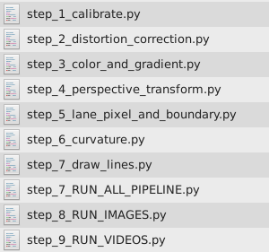
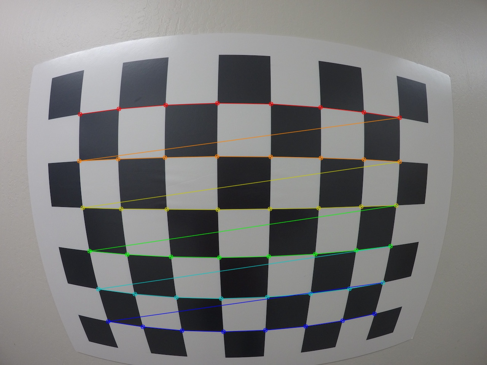
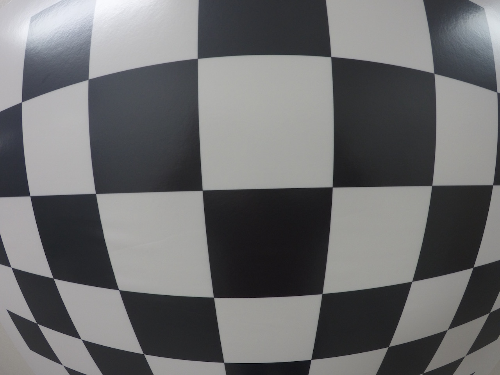
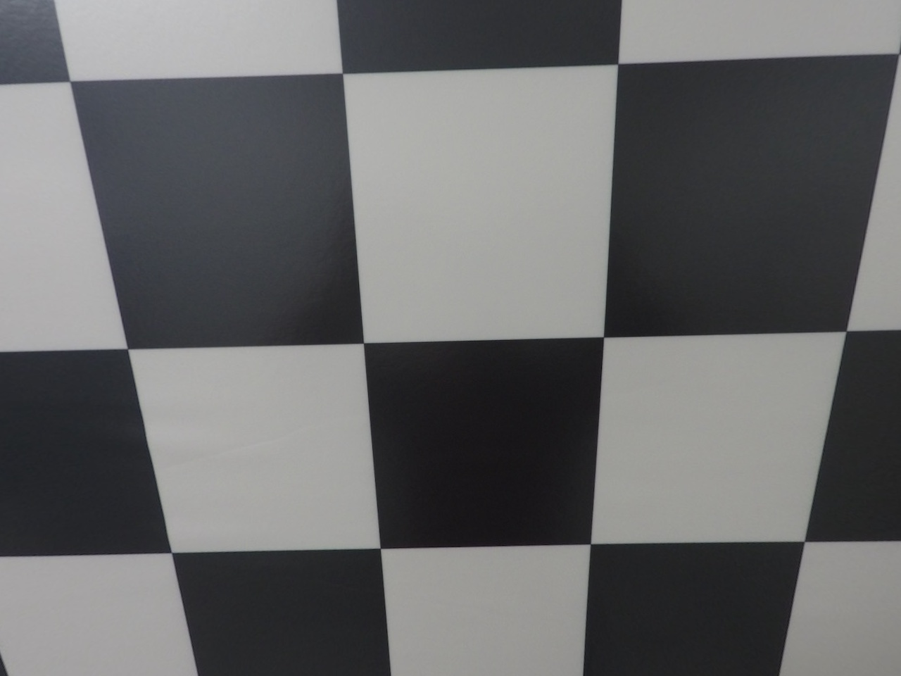
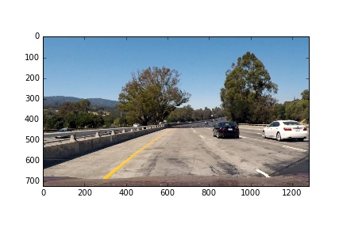
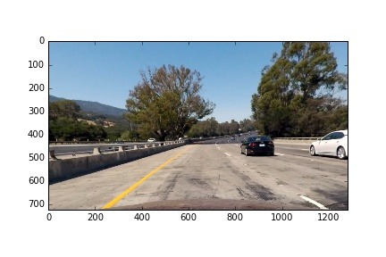
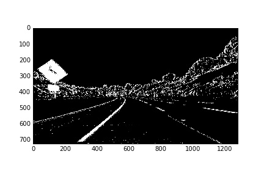
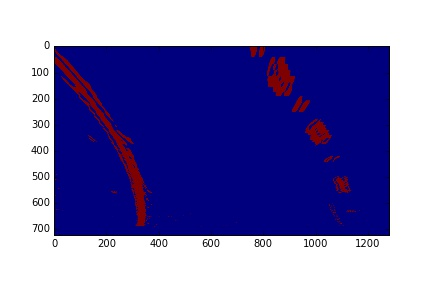
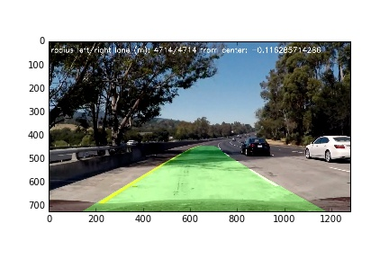

# Udacity-SDC-T1-P4 - Advanced Lane Finding Project

##Important General Information

The code for this project is not stored in one file. Instead, the pipeline was broken down in several steps. Each step is being done in a separate function and in a separate file. The steps are:

To run the pipeline for the test images we execute the script **step_8_RUN_IMAGES.py** and for the videos the file **step_9_RUN_VIDEOS.py** was used. This allowed building the pipeline step by step and keeping the code clean. 

##Camera Calibration
###1. Briefly state how you computed the camera matrix and distortion coefficients. Provide an example of a distortion corrected calibration image.

The code for this step in the project can be found in **step_1_calibrate.py**

We iterate over a number of images that are stored in a folder. Each image shows a chessboard photographed with the same camera like in the car. And each image is being used for calibration. To do that, corners of the image are being marked. This happens in this line of code: 

`cv2.drawChessboardCorners()`

We then save for testing pursposes the images in the folder **calibration_corners**. The images look like this: 

Then the camera is being calibrated in this line of code:

`cv2.calibrateCamera()`

The output of this method is a set of parameters needed to correct/undistort images. We store these parameters in a list so that we can store them later in a pickle file. 

Here are 2 images - once undistorted and once distorted. The undistorted version is being creted when running the script in file **step_8_RUN_IMAGES.py**

##Pipeline (single images)
###1. Provide an example of a distortion-corrected image.

The output images of tests with images are stored in the folder **output_images**

This image is distorted

This is the same image but undistorted

###3. Describe how (and identify where in your code) you performed a perspective transform and provide an example of a transformed image.

This part of the process is being performed in the script **step_4_perspective_transform.py** 

First we get warp parameters and then we apply these warp parameters to the image in the method `warp()`. The Warp parameters used in method `get_warp_params()` were inserted manually. 

Before perspective transform (warp)

After perspective transform (warp)

###4. Describe how (and identify where in your code) you identified lane-line pixels and fit their positions with a polynomial?

This happens in script **step_5_lane_pixel_and_boundary.py** 
In this file there is a method called `def find_lane(binary_warped) `

The steps of this method are: 

1. Make a histogram horizontally
2. Split the histogram in 2 pieces for the left lane and for the right lane
3. Using the histogram data identify where most non-zero pixels are. The location of the most non-zero pixels is the start of the lane. 
4. We draw rectangles on the area with highest density of non-zero pixels and then on top to this rectangle the next rectangle until we reach the top of the image. We need to adjust the position of the rectangles depending on the frequency of the non-zero pixels. 
5. In the line np.polyfit(lefty, leftx, 2) we draw a polynomial using the result of the previous steps. This polynomial represents the curve. 

###5. Describe how (and identify where in your code) you calculated the radius of curvature of the lane and the position of the vehicle with respect to center.

This happens in the script **step_6_curvature.py** and function `calculate_radius(left_fit, right_fit)`

When we created the polyfit in **step_5_lane_pixel_and_boundary.py** we already took care of the fact that calculation in pixels is not the same like real world meters. This transformation happened at the end of the method find_lane(binary_warped). Now in method `calculate_radius(left_fit, right_fit)` we apply the mathematical formula to convert a curvature into a radius. 

At the end of this method we prepare a text that contains the radius in meters. We will use this text later to write on the image. Therefore the method returns this text. 

The position of the vehicle on the lane is calculated in method find_lane(binary_warped) in file **step_5_lane_pixel_and_boundary.py** in these lines

`position_of_car = (rightx_base - leftx_base) / 2 + leftx_base  `
`delta_of_car = (midpoint - position_of_car) * xm_per_pix `

###6. Provide an example image of your result plotted back down onto the road such that the lane area is identified clearly.

Here is an example of the final result. 

For more iamges showing the pipeline please look into folder **./output_images/**

##Pipeline (video)

###1. Provide a link to your final video output. Your pipeline should perform reasonably well on the entire project video (wobbly lines are ok but no catastrophic failures that would cause the car to drive off the road!).

There is a link to the video - it should download the file <a href="https://github.com/AlexSickert/Udacity-SDC-T1-P4/blob/master/output_videos/result-1.mp4?raw=true" target="_blank">LINK TO VIDEO</a>. Altenratively, it is located here in the repository under **/output_videos/result-1.mp4**

##Discussion

###1. Briefly discuss any problems / issues you faced in your implementation of this project. Where will your pipeline likely fail? What could you do to make it more robust?

